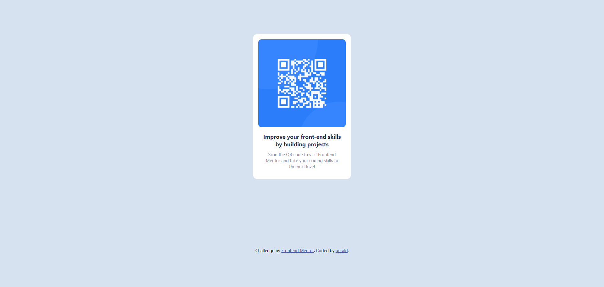
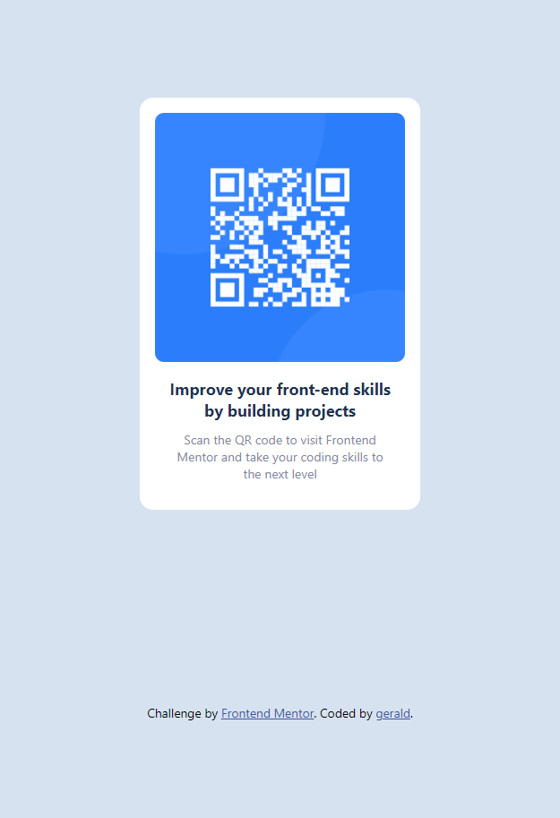

# Frontend Mentor - QR code component solution

This is a solution to the [QR code component challenge on Frontend Mentor](https://www.frontendmentor.io/challenges/qr-code-component-iux_sIO_H). 

## Table of contents

- [Overview](#overview)
  - [Screenshot](#screenshot)
  - [Links](#links)
- [My process](#my-process)
  - [Built with](#built-with)
  - [What I learned](#what-i-learned)
  - [Continued development](#continued-development)
  - [Useful resources](#useful-resources)
- [Author](#author)
- [Acknowledgments](#acknowledgments)


## Overview

### Screenshot





### Links

- Solution URL: [Add solution URL here](https://your-solution-url.com)
- Live Site URL: [Add live site URL here](https://your-live-site-url.com)


### Built with

- Semantic HTML5 markup
- CSS custom properties
- Flexbox
- CSS Grid
- Mobile-first workflow

### What I learned
I use this section to highlight my major learnings while working through this short project since this will be a great way to reinforce my own knowledge.

```html
  <div class="container">
    
    <h4 class="intro">
      Improve your front-end skills by building projects
    </h4>
    <p class="sub__intro">
      Scan the QR code to visit Frontend Mentor and take your coding skills to the next level
    </p>
  </div>
```

```css

@import url('https://fonts.googleapis.com/css2?family=Outfit:wght@100..900&display=swap');

```

If I want more help with writing markdown, I just check out [The Markdown Guide](https://www.markdownguide.org/) to learn more.


### Continued development
Wanna give it a shot again using frontend frameworks.

### Useful resources

[FireShot](https://getfireshot.com/) - to take the screenshot.

 google Fonts: (https://fonts.google.com/specimen/Outfit) - I have the link already imported in the styles sheet, just that have commented out the Outfit font-family since with windows browser wasn't looking great. Though feel free to un-comment it out if it looks great on yours.

## Author

<!-- - Website - [Add your name here](https://www.your-site.com) -->

- Frontend Mentor - [@gerald-ssebaggala](https://www.frontendmentor.io/profile/gerald-ssebaggala)

## Acknowledgments

Haha to the one and only ....I myself ✌️
